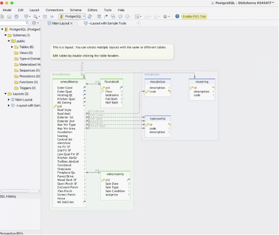
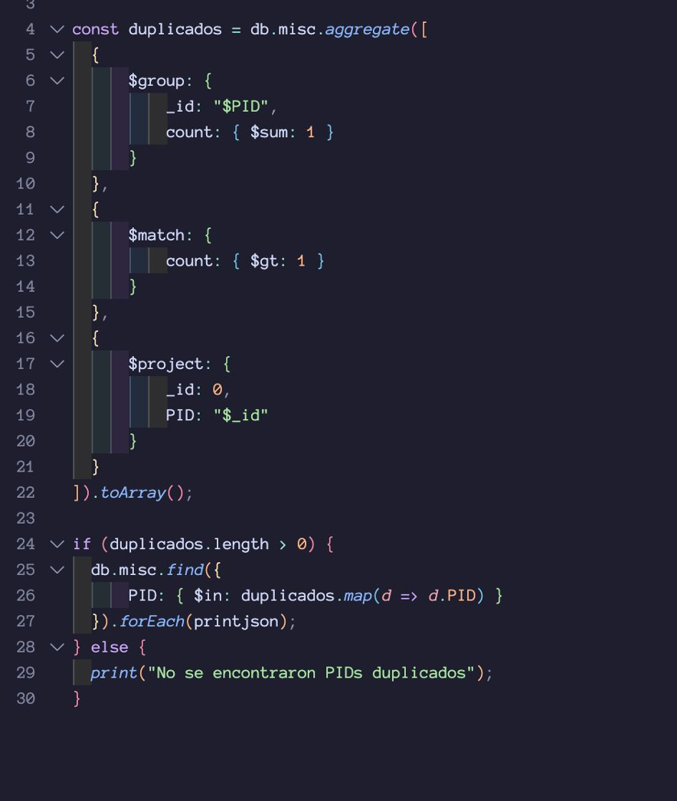
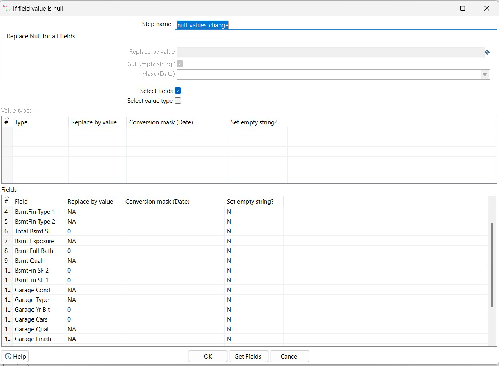

# Archivo Markdown - Entregable

## Nombre del Proyecto: Proyecto Final ETL

## -- Project Status: [Completed]

## Miembros del equipo

Team Leader: [Daniel Martinez]()(https://github.com/Daniel1martinez2) Instructor: [Angela Villota]

## Other Members:

Name	Email
[Alejandra Ruiz](https://github.com/alejaguz)	@alejaguz
[Luis Felipe Montenegro](https://github.com/felipe-montenegro)	@felipe-montenegro
[Juan Camilo Vergara](https://github.com/juancamilovergaraarenas)	@juancamilovergaraarenas

## Contact

Team Leader: [Daniel Martinez]()(https://github.com/Daniel1martinez2)

## Introducción/Objetivo del Proyecto

Construir el proceso ETL utilizando Pentaho Data Integration (PDI) con el fin de obtener un archivo csv, realizando el proceso de extracción y transformación de los datos disponibles en la base de datos relacional BD Ames, en archivos csv y en MongoDB. 

## Métodos Utilizados

- PgAdmin para bases de datos relacionales (PostGres)
- MongoDB para documentos
- Pentaho para integración de Bases

## Descripción del Proyecto

1. Archivo de Inmobiliaria (BASE RELACIONAL)

- Se carga el script para crear el DataBase y se crean las tablas vacias
- Se cargan los scripts de cada tabla y se cargan en el siguiente orden: primero, las que no tienen relaciones con otras tablas para evitar error de relaciones que puedan darse con tablas que no existan

Orden (se adjuntan algunos recortes de ejemplo):
- TypeQuality primero porque es base de otras tablas
- Mszoning segundo porque también es una tabla base de otras
- Msubclass tercero porque también es una tabla base de otras
 
 

- Amsdbtemp es la cuarta

 

- Salesproperty es la quinta

 

- Floordetail es la √∫ltima por cargar

 

Luego de hacer esto entonces revisamos el diagrama relacional resultante:

 

En este caso nos damos cuenta que no coincide con el diagrama relacional real y por ende revisamos el código de los scripts y no encontramos una relación creada. Así que procedemos a completar el código para generar las relaciones pertinentes.

Se crea entonces las relaciones de typequality, mszoning y mssubclass:

 

Diagrama resultante del código:

 

2. Carga Base de Datos 2: Infrati Test - MongoDB

 

3. Carga de Base de Datos relacional BD Ames a Pentaho 

4. Antes de llevar a cabo el Join completo de la base de datos relacional, se lleva a cabo el c√°lculo de las variables FullBath, HalfBath y Bedroom

Adicionalmente, se hizo la modificación de Fecha de venta, asegurando que en la salida solo esté el mes y el año de venta

5. Join de bases de datos 

Luego para practicidad del ejercicio entonces se realizó el join de la mayoría de tablas excepto amesdbtemp debido a que esta base de datos tiene muchas variables

 

Luego se terminó de unificar la tabla de la base relacional con amesdbtemp para construir el primer merge y luego crear el merge completo:

 

6. Carga de CSV
 

7. Paso intermedio - Transformaciones

Para poder realizar las transformaciones de las bases de datos, realizamos un barrido donde identificamos la fuente y nombres de variables de la salida esperada, de la siguiente manera (donde dejamos en amarillo aquellas que requieren un c√°lculo):

8. Se lleva al c√°lculo de la variable gr_live_area utilizando el calculator
 

9. Se lleva a cabo el merge con la base de datos CSV Property

10. Se llevó a cabo la transformación solicitada para la variable Year_Remod/Add

- Se filtra la información en donde la varibale Year_Remod/Add es nula

- Luego, aquellas celdas nulas se imputaron con el contenido de la variable Year_built

- Luego se hizo la unión entre los imputados y los que quedaron fuera del primer filtro

11. En este paso se llevó a cabo la carga de las bases de datos de mongo:

- Bsmt
- Garage
- Misc
- Pool

Para cada una realizamos tres operaciones: la carga, el sort y el merge con las otras bases: 

- La carga

- El sort

- El merge

*Importante fue deseleccionar el output single JSON field, para que se transformara en formato de tabla y asi si se pudiera realizar el Merge. Para este caso, fue importante que se realizara un left outer join para que se hiciera el merge correctamente, porque las bases de mongo tenían menos valores y por eso queríamos conservar la tabla con mayor cantidad de datos y hacer el join con los menores valores de mongo.

 se validó que no existieran duplicados a la hora de realizar el Merge

Al final de este proceso, las bases de mongo quedaron así:

12. Luego de realizar la carga de los datos de MongoDB, se lleva a cabo la imputación de datos faltantes de la siguiente manera: NA si es cualitativa y 0 si la variable es númerica

13. Luego se llevó a cabo la transformación de la variable Neighborhood. En primer lugar se creó un archivo CSV que luego fue imputado al pentaho

14. Posterior a esto se llevó a cabo el merge entre la base de datos resultante después de realizar todo el proceso de merge de las bases de datos de mongo con el CSV cargado

15. A continuación se lleva  acabo la transformación de la variable LotShape utilizando la función value mapper

16. Para finalizar el proceso de tranformación y para asegurar la calidad de la salida se hizo una selección de valores en la que se realizaron los siguientes cambios:

- Se eliminaron columnas duplicadas

- Se renombró la variable Bedroom por Bedroom AbvGr

- Se renombró la variable Code por Neighborhood

17. Finalmente se exportó el archivo definivo utilizando la función test_file_output

18. AsÌ quedÛ el pipeline de todo el proceso:

## Lecciones aprendidas:

- Es importante mencionar que a lo largo del flujo de trabajo siempre se llevó a cabo un proceso de ordenamiento de los datos previo a cada merge, esto con el objetivo de asegurar la calidad de los datos evitando duplicados, errores y buscanod mantener relaciones correctas entre las tablas.

- Con el propósito de reducir el exceso de pasos y  procesamientos en la herramienta Pentaho, es relevante optimizar las queries realizadas en el preprocesamientos de la carga inicial de los datos

- Reforzar que el n√∫mero de filas esperadas depende de la cantidad de IDS que se tengan en total de todas las fuentes. 

